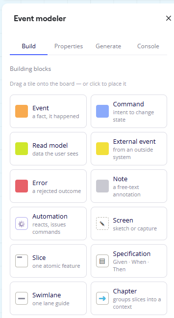
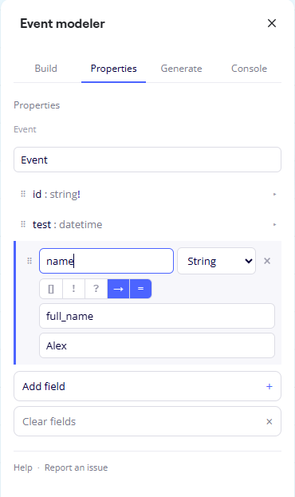
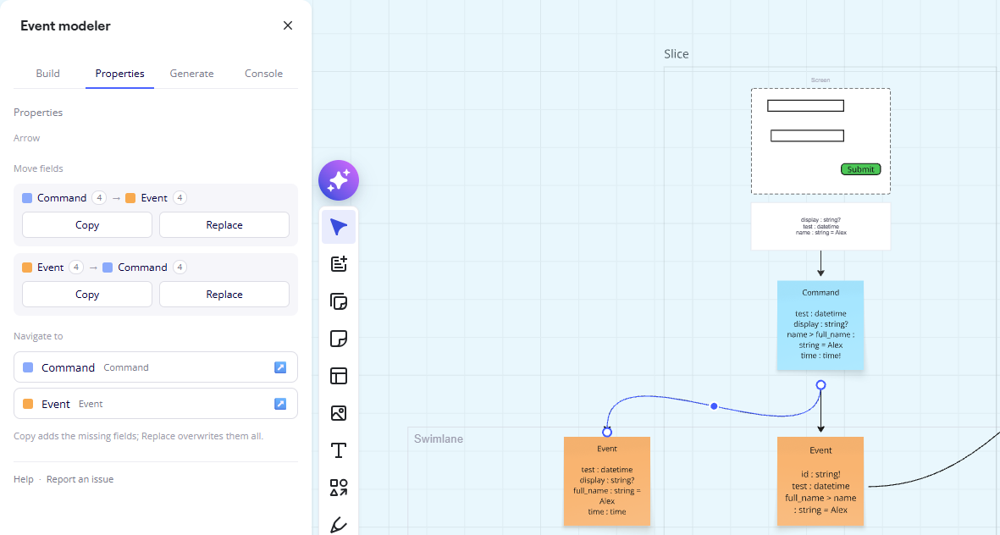
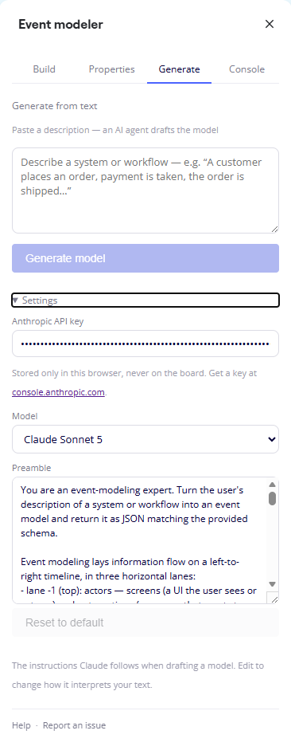
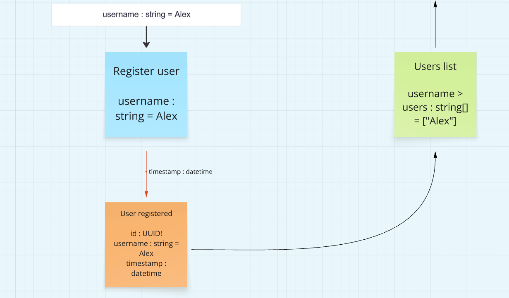

# Miro Event Modeler

A [Miro](https://miro.com) app for [event modeling](https://eventmodeling.org),
built on the **Web SDK v2** with **React + TypeScript**. The toolbar icon opens a
four-tab panel; everything it places is a native, editable Miro widget. See the
[user guide](docs/USER-GUIDE.md) for the full walkthrough.

## The panel

**Build** — the modeling palette. Drag a tile onto the board, or click to place
it at the center of the view. The colored tiles are the typed blocks (**Event**,
**Command**, **Read model**, **External event**, **Error**, **Note**,
**Automation**, **Screen**) — a sticky's fill color denotes its type. Below them
are the tool tiles — **Slice** (a frame holding one atomic feature),
**Specification** (a Given/When/Then frame whose **+** buttons pull in linked
copies of blocks from the model), **Swimlane**, and **Chapter** — plus the
one-click **pattern stamps** and the **Convert** tools. Blocks are linked with
Miro's own connector tool.



**Properties** — rename the selected block and give data-bearing blocks named,
typed **fields** (shown in a sticky's own text, or an attached box beneath a
screen or automation). Each field is one board-notation line; the toggles build
up the notation — `[]` (collection), `!` (generated), `?` (optional), `→` (fed by
an upstream field, an alias), and `=` (an example). Here an `Event`'s `name` is
aliased from an upstream `full_name`, with the example `Alex`.



Select a single attached connector and the same tab becomes the **arrow
toolset** — **Copy** merges fields across the link, **Replace** overwrites them,
and **Navigate to** pans the viewport to either end.



**Generate** *(beta)* — paste a description of a system or workflow (or import a
Figma file or exported design PDFs) and Claude drafts a whole model: typed blocks
in three lanes, connectors, slices, and Given/When/Then specifications. Your
Anthropic API key is stored only in this browser (never on the board); pick a
model and, if you want, edit the system-prompt preamble.
> **Beta.** AI-drafted models are a starting point to refine, not a finished
> model — accuracy varies by source, and a large design can exceed a single
> board's storage.



**Console** *(not pictured)* — a running log of any failure the app hit (it keeps
recording while the panel is closed), plus a meter of the Miro API credits spent
over the last minute and hour.

### The completeness check

A background pass reddens every arrow into a block whose incoming blocks don't
supply all its required fields, captioning the arrow with the shortfall. Below,
the `Register user` command doesn't supply the `timestamp` that `User registered`
requires, so the arrow is red and labelled `timestamp : datetime` (the generated
`id : UUID!` is exempt — nothing upstream needs to provide it).



## How a Miro app works

A Miro app is a small web app that Miro loads inside a board:

| File              | Role                                                                                                     |
| ----------------- | -------------------------------------------------------------------------------------------------------- |
| `index.html`      | The **App URL**. Loads on the board (invisibly) and registers the toolbar icon.                          |
| `app.html`        | Hosts the **React panel** — React mounts into its `#root` element.                                       |
| `src/index.ts`    | Headless board-script composition root: wires the Miro adapters, the icon-click and selection flows, and the background housekeeping passes. |
| `src/app.tsx`     | Panel composition root: wires the adapters (incl. the Anthropic planner) and mounts the React panel.     |
| `src/domain/*`    | Pure, platform-free event-modeling logic (vocabulary, fields, specs, completeness, the generator plan, …) — never touches `miro`. |
| `src/ports/*`     | The interfaces the use-cases speak to (`Canvas`, store, notifier, viewport, planner, …).                 |
| `src/services.ts` | The service locator — the one seam where a feature obtains its ports.                                     |
| `src/features/*`  | The use-cases, one module per feature (stickies, screens, slices, specs, fields, generate, …) — talk only to ports. |
| `src/adapters/*`  | The only place platform SDKs appear: `miro/` (Web SDK), `anthropic/` (the AI planner, panel-only), `browser/` (diagnostics + credit meter). |
| `src/panel/*`     | React components: the four-tab `Panel` and its section components, each with co-located CSS.             |
| `vite.config.ts`  | React plugin, dev server on port 3000, both HTML pages as build inputs.                                  |
| `tsconfig.json`   | TypeScript config (strict, `react-jsx`, Miro SDK global types).                                          |

The `src/` tree is a **hexagonal (ports-and-adapters)** architecture: the domain
and features never import `miro`, so the event-modeling logic can be lifted onto
another canvas by swapping the adapter set. The `miro` global itself is typed by
[`@mirohq/websdk-types`](https://www.npmjs.com/package/@mirohq/websdk-types),
wired in via the `types` field of `tsconfig.json` — no import needed.

## Prerequisites

- Node.js 20.19+ / 22.12+ / 24+ and npm (required by Vite 8)
- A Miro account with a **Developer team** (free — created automatically when you make your first app)

## 1. Install & run the dev server

```bash
npm install
npm run start
```

This serves the app at **http://localhost:3000**. Leave it running.

Other scripts: `npm run typecheck` (run `tsc`), `npm run build` (typecheck + production build), `npm run preview` (serve the build).

## 2. Register the app in Miro

1. Go to **https://miro.com/app/settings/user-profile/apps** (Profile settings → **Your apps**) and click **Create new app**.
2. Give it a name (e.g. `Event Modeler`), select your **Developer team**, and create it.
3. On the app settings page:
   - Under **App URL**, enter `http://localhost:3000` (Miro allows `http` for `localhost` during development).
   - Under **Permissions / Scopes**, enable **`boards:read`** and **`boards:write`**.
   - *(Optional)* upload an app icon.
4. Click **Install app and get OAuth token**, choose your Developer team, and confirm.

## 3. Use it on a board

1. Open (or create) a board in that Developer team.
2. In the left toolbar, open the **Apps** menu (the "+" / "More apps" icon) and select your app — its icon is added to the toolbar.
3. Click the icon → the panel opens → drag a building block onto the board. 🎉

## Build for production

```bash
npm run build     # typecheck, then output static files to dist/
npm run preview   # serve the production build locally
```

Deploy `dist/` to any static host (Vercel, Netlify, GitHub Pages, …) and update the
**App URL** in your Miro app settings to the deployed HTTPS URL.

## References

- [Build your first Hello World app](https://developers.miro.com/docs/build-your-first-hello-world-app)
- [Add icon click to your app](https://developers.miro.com/docs/add-icon-click-to-your-app)
- [Web SDK reference](https://developers.miro.com/docs/web-sdk-reference)
